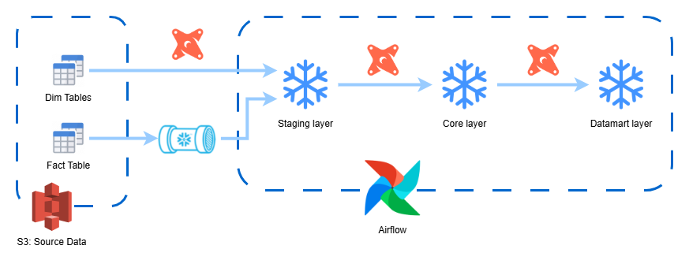
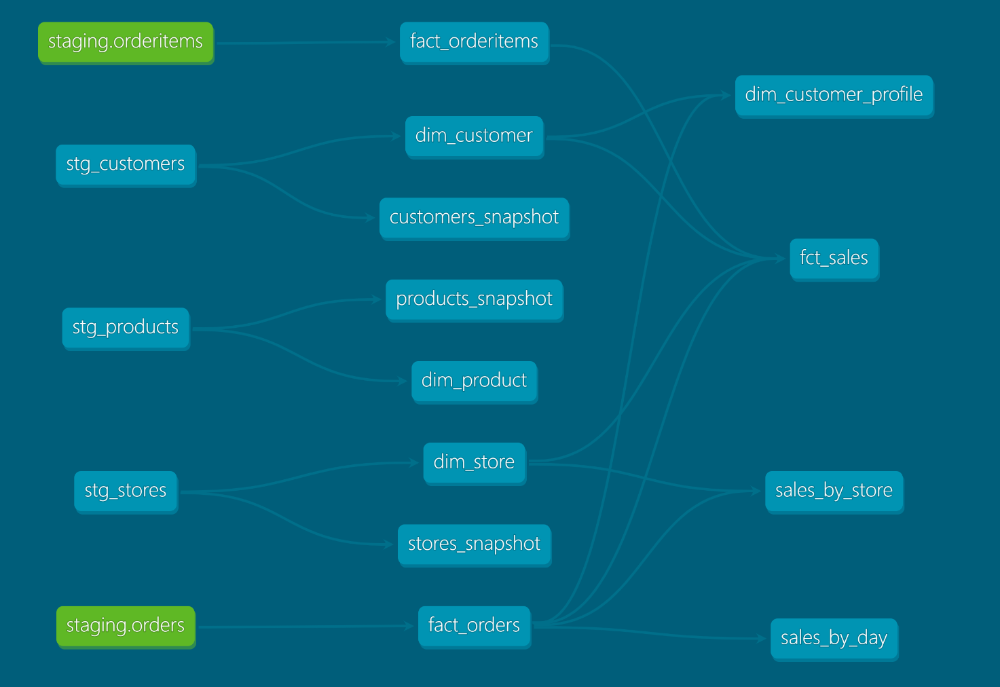
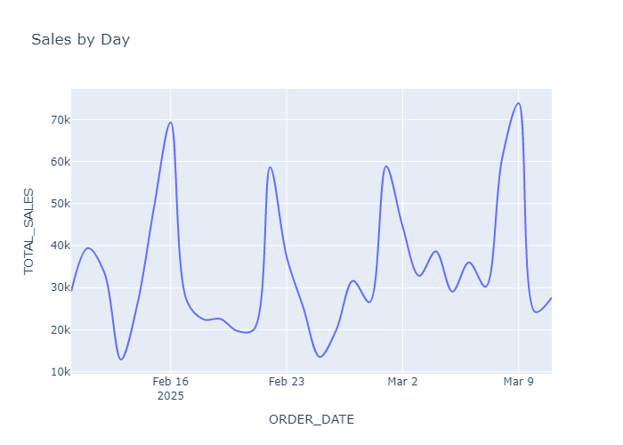
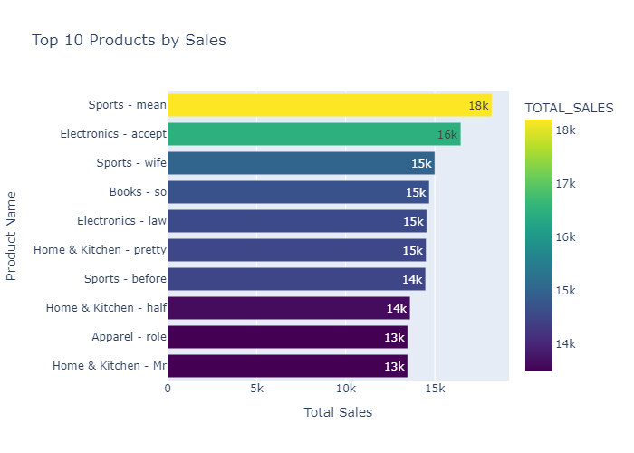
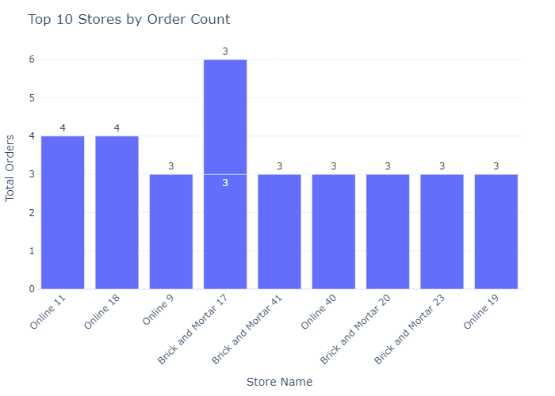
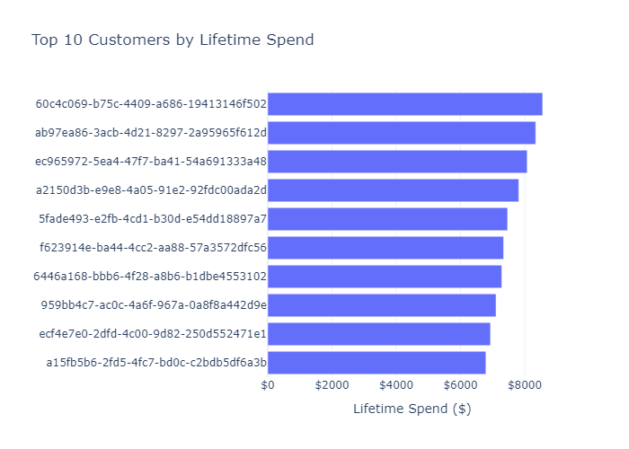
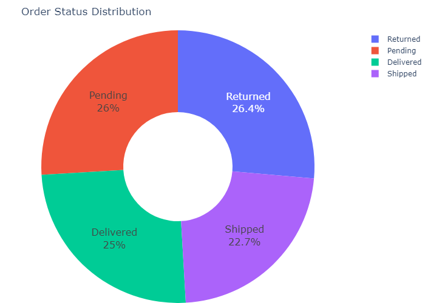

# Retail360 with Snowflake & DBT

## Introduction and Project Architecture

### Overview
This project is a comprehensive data engineering solution that seamlessly integrates **Snowflake** as the data warehouse and **DBT** (Data Build Tool) for transformation, all orchestrated by **Airflow**. Leveraging **Terraform** for infrastructure provisioning, the project automates the ingestion, transformation, and visualization of large-scale data sourced primarily from AWS S3. The system is designed for scalability, modularity, and ease of maintenance, ensuring data quality and robust performance across the entire pipeline.

### Architecture & Data Flow
The solution is structured around a multi-layered architecture that facilitates smooth data movement and transformation:

- **Data Ingestion & Orchestration:**  
  Data is ingested from AWS S3 into Snowflake through automated Airflow DAGs. These DAGs not only handle data ingestion but also perform critical maintenance tasks such as cleaning up old data in S3 and Snowflake, configuring Snowpipe for continuous ingestion, and running DBT transformations.

- **Data Transformation:**  
  Once the data is staged in Snowflake, DBT models transform it through various layers:
  - **Staging:** Raw data is loaded into the STAGING schema.
  - **Silver (Core):** Cleaned and enriched data is stored in the CORE schema.
  - **Gold (Marts):** Business-ready, aggregated data is provided in the MARTS schema.

- **Infrastructure Automation:**  
  Terraform scripts provision and configure the necessary AWS and Snowflake resources, including S3 buckets, Snowflake databases, schemas, warehouses, and stages.

To visually represent the overall system design and data lineage, the following diagrams are included:

- **Data Architecture Diagram:**  
    
  *[misc/data_architecture_diagram.png](misc/data_architecture_diagram.png)*  
  This diagram provides a high-level overview of the system components and their interconnections.

- **DBT Data Lineage Graph:**  
    
  *[misc/data_lineage_from_dbt_docs.png](misc/data_lineage_from_dbt_docs.png)*  
  This graph illustrates the transformation flow and dependencies across DBT models.

### Core Components & Key Files
The project is organized into three main directories, each serving a critical role in the solution:

#### 1. Airflow
This directory contains the orchestration scripts and DAGs that automate various tasks such as data ingestion, transformation, and maintenance. Key files include:
- **[airflow/docker-compose.yml](airflow/docker-compose.yml):**  
  Configures the Airflow environment using Docker Compose.
- **[airflow/dags/cleanup_s3_and_snowflake.py](airflow/dags/cleanup_s3_and_snowflake.py):**  
  Contains logic to delete files from S3 and drop tables in Snowflake, ensuring a clean slate for new data.
- **[airflow/dags/configure_snowpipe.py](airflow/dags/configure_snowpipe.py):**  
  Automates the setup and configuration of Snowpipe for continuous data ingestion from S3.
- **[airflow/dags/dbt_dag.py](airflow/dags/dbt_dag.py):**  
  Orchestrates DBT tasks, including dependency management, running transformations, snapshots, and tests.
- Additional DAGs (e.g., `generate_orders_data_continuous_dag.py`, `generate_static_data_dag.py`, and `test_snapshot_modifications.py`) manage the continuous generation of synthetic data and test scenarios.

#### 2. DBT
This directory houses the DBT project responsible for transforming raw data into analytics-ready datasets. Notable files include:
- **[dbt/retail360_dbt/dbt_project.yml](dbt/retail360_dbt/dbt_project.yml):**  
  Main configuration file defining the DBT project structure and model paths.
- **[dbt/retail360_dbt/profiles.yml](dbt/retail360_dbt/profiles.yml):**  
  Contains connection settings for Snowflake, ensuring smooth communication between DBT and the data warehouse.
- Models are categorized into layers such as **staging**, **silver**, and **gold** to enforce a structured transformation process.
- Macros, snapshots, and test configurations are provided to ensure data integrity and quality across transformations.

#### 3. Terraform
Terraform scripts are used to provision the necessary cloud resources and manage infrastructure configurations. Key files include:
- **[terraform/main.tf](terraform/main.tf):**  
  Defines the providers and overall infrastructure configuration.
- **[terraform/airflow.tf](terraform/airflow.tf):**  
  Manages the deployment of the Airflow services.
- **[terraform/s3.tf](terraform/s3.tf) & [terraform/snowflake.tf](terraform/snowflake.tf):**  
  Configure and provision AWS S3 buckets and Snowflake resources (databases, schemas, warehouses, and stages).

### Visualization Assets
In addition to architecture diagrams, the project includes several visualization assets that offer insights into data trends and system performance:

- **Sales by Day Chart:**  
    
  *[misc/sales_by_day.png](misc/sales_by_day.png)*  
  A line chart displaying daily total sales over time with a smooth spline curve.

- **Top Products Analysis:**  
    
  *[misc/top_products.png](misc/top_products.png)*  
  A horizontal bar chart that highlights the top 10 products by total sales, complete with annotated sales values.

- **Top Stores Analysis:**  
    
  *[misc/top_stores.png](misc/top_stores.png)*  
  A bar chart that represents the top 10 stores by order count with clear labeling and rotated x-axis labels.

- **Top Customers Analysis:**  
    
  *[misc/top_customers.png](misc/top_customers.png)*  
  A horizontal bar chart showcasing the top 10 customers by lifetime spend, with the smaller values positioned at the top.

- **Order Status Distribution:**  
    
  *[misc/order_status.png](misc/order_status.png)*  
  A donut pie chart that illustrates the distribution of order statuses, featuring percentages and labels displayed within each slice.

## Detailed Workflow – Airflow DAGs & DBT Integration

### Airflow: Orchestration and Pipeline Management

Airflow is the backbone of our data pipeline, automating tasks from data ingestion and cleaning to transformation and quality testing. The project’s Airflow folder contains several DAGs (Directed Acyclic Graphs) and utility modules, each with a specific responsibility.

#### Key Airflow Components

- **Docker & Environment Setup:**  
  - **[airflow/docker-compose.yml](airflow/docker-compose.yml):**  
    Defines the Airflow deployment using Docker Compose. It specifies environment variables (such as Snowflake and AWS credentials), volume mounts for DAGs, logs, configurations, and plugins, as well as dependencies on services like Postgres and Redis. This setup ensures a reproducible environment for running and scaling Airflow tasks.

- **Cleanup and Maintenance DAG:**  
  - **[airflow/dags/cleanup_s3_and_snowflake.py](airflow/dags/cleanup_s3_and_snowflake.py):**  
    This DAG automates the cleanup process by:
    - Deleting all files from a specified AWS S3 bucket.
    - Dropping tables from various Snowflake schemas (STAGING, CORE, MARTS) to avoid data clutter.
    - Removing DBT-generated directories to prepare for a fresh run.
    
    The DAG uses PythonOperators that call utility functions for S3 operations and Snowflake queries via the custom helper in [snowflake_util.py](airflow/dags/utils/snowflake_util.py).

- **Snowpipe Configuration DAG:**  
  - **[airflow/dags/configure_snowpipe.py](airflow/dags/configure_snowpipe.py):**  
    This DAG handles the integration between Snowflake and AWS S3 using Snowpipe:
    - It creates an IAM role with a dummy trust policy and then updates it once Snowflake provides the actual integration details.
    - It sets up a Snowflake storage integration and stage to enable auto-ingestion of CSV files.
    - The DAG also creates tables in Snowflake and configures Snowpipes (for both orders and order items) to automatically ingest data as it lands in S3.
    - Finally, it configures S3 bucket notifications to trigger Snowpipe, ensuring near-real-time data ingestion.

- **DBT Orchestration DAGs:**  
  - **[airflow/dags/dbt_dag.py](airflow/dags/dbt_dag.py):**  
    This DAG coordinates the execution of DBT tasks. It runs commands in sequence to:
    - Install DBT dependencies (`dbt deps`).
    - Execute the transformation models (`dbt run`).
    - Create snapshots (`dbt snapshot`).
    - Run tests (`dbt test`) to ensure data quality.
    
    This tightly integrates the DBT transformation layer into the overall data pipeline.
    
  - **[airflow/dags/dbt_docs_server.py](airflow/dags/dbt_docs_server.py):**  
    This DAG is responsible for generating and serving DBT documentation. It:
    - Generates the DBT docs using `dbt docs generate`.
    - Serves the generated documentation on port 8081 in a background process.  
    This facilitates easy access to model details, lineage, and documentation through a web interface.

- **Data Generation DAGs:**  
  - **[airflow/dags/generate_orders_data_continuous_dag.py](airflow/dags/generate_orders_data_continuous_dag.py):**  
    This DAG continuously simulates real-time data by generating synthetic orders and order items:
    - It waits for static data (customers, products, and stores) to be available in S3.
    - Once confirmed, it generates a random number of orders (between 400 and 1000) and uploads the CSV files to S3 with a timestamp, simulating a continuous data stream.
    
  - **[airflow/dags/generate_static_data_dag.py](airflow/dags/generate_static_data_dag.py):**  
    Focuses on generating synthetic static datasets for customers, products, and stores.  
    - The generated CSV files are uploaded to S3 under fixed keys (e.g., `customers/latest.csv`), providing a baseline for further transformations.
    
- **Data Modification DAG (Snapshot Testing):**  
  - **[airflow/dags/test_snapshot_modifications.py](airflow/dags/test_snapshot_modifications.py):**  
    This DAG tests the snapshot functionality by:
    - Identifying the latest CSV file for each data type (customers, products, stores).
    - Modifying approximately 5% of the rows (e.g., updating names or prices) and timestamping the modifications.
    - Uploading only the modified rows back to S3, allowing for incremental snapshot testing and validation.
    
#### Airflow Utility Modules

- **[airflow/dags/utils/generate_data.py](airflow/dags/utils/generate_data.py):**  
  Contains helper functions to generate synthetic data:
  - Functions to create random timestamps, customer records, product details, store information, and orders.
  - The randomness is enhanced with weighted distributions to simulate real-world data trends, such as higher probabilities for certain days or times.
  
- **[airflow/dags/utils/snowflake_util.py](airflow/dags/utils/snowflake_util.py):**  
  This module abstracts the connection and query execution against Snowflake:
  - Uses Airflow’s BaseHook to retrieve connection credentials.
  - Provides a unified function to execute single or multiple queries against the Snowflake instance.
  - It is referenced across multiple DAGs, ensuring consistent interactions with Snowflake.

### DBT Integration and Transformation Workflows

DBT (Data Build Tool) is used to orchestrate the transformation of raw data into analytics-ready datasets. The DBT project is organized with a clear separation of concerns across three layers:

#### DBT Project Structure

- **Configuration Files:**  
  - **[dbt/retail360_dbt/dbt_project.yml](dbt/retail360_dbt/dbt_project.yml):**  
    Defines the project name, version, model paths, and materialization strategies. It specifies how models are organized across staging, silver, and gold layers.
    
  - **[dbt/retail360_dbt/profiles.yml](dbt/retail360_dbt/profiles.yml):**  
    Contains the connection details for Snowflake. Environment variables are used to securely pass credentials, roles, and schema configurations.

- **Models & Transformations:**  
  DBT models are organized into three main layers:
  - **Staging:**  
    Raw data ingestion from S3 is handled by models in the staging layer. For example:
    - **[dbt/retail360_dbt/models/staging/stg_customers.sql](dbt/retail360_dbt/models/staging/stg_customers.sql)**
    - **[dbt/retail360_dbt/models/staging/stg_products.sql](dbt/retail360_dbt/models/staging/stg_products.sql)**
    - **[dbt/retail360_dbt/models/staging/stg_stores.sql](dbt/retail360_dbt/models/staging/stg_stores.sql)**
    
  - **Silver (Core Transformations):**  
    Clean and enriched datasets are created in this layer. Models such as:
    - **[dbt/retail360_dbt/models/silver/dim_customer.sql](dbt/retail360_dbt/models/silver/dim_customer.sql)**
    - **[dbt/retail360_dbt/models/silver/dim_product.sql](dbt/retail360_dbt/models/silver/dim_product.sql)**
    - **[dbt/retail360_dbt/models/silver/dim_store.sql](dbt/retail360_dbt/models/silver/dim_store.sql)**
    - **[dbt/retail360_dbt/models/silver/fact_orderitems.sql](dbt/retail360_dbt/models/silver/fact_orderitems.sql)**
    - **[dbt/retail360_dbt/models/silver/fact_orders.sql](dbt/retail360_dbt/models/silver/fact_orders.sql)**
    
    These models include tests defined in associated YAML files:
    - **[dbt/retail360_dbt/models/silver/fact_tests.yml](dbt/retail360_dbt/models/silver/fact_tests.yml)**
    - **[dbt/retail360_dbt/models/silver/silver_tests.yml](dbt/retail360_dbt/models/silver/silver_tests.yml)**
    
  - **Gold (Data Marts):**  
    Business-ready aggregations and analytical views are defined in the gold layer:
    - **[dbt/retail360_dbt/models/gold/dim_customer_profile.sql](dbt/retail360_dbt/models/gold/dim_customer_profile.sql)**
    - **[dbt/retail360_dbt/models/gold/fct_sales.sql](dbt/retail360_dbt/models/gold/fct_sales.sql)**
    - **[dbt/retail360_dbt/models/gold/sales_by_day.sql](dbt/retail360_dbt/models/gold/sales_by_day.sql)**
    - **[dbt/retail360_dbt/models/gold/sales_by_product.sql](dbt/retail360_dbt/models/gold/sales_by_product.sql)**
    - **[dbt/retail360_dbt/models/gold/sales_by_store.sql](dbt/retail360_dbt/models/gold/sales_by_store.sql)**
    
    These models not only transform data but also optimize query performance with clustering and materialization strategies.

#### Advanced DBT Features

- **Snapshots:**  
  DBT snapshots capture historical changes in data over time. In our project, snapshots are configured for:
  - **[dbt/retail360_dbt/snapshots/customers_snapshot.sql](dbt/retail360_dbt/snapshots/customers_snapshot.sql)**
  - **[dbt/retail360_dbt/snapshots/products_snapshot.sql](dbt/retail360_dbt/snapshots/products_snapshot.sql)**
  - **[dbt/retail360_dbt/snapshots/stores_snapshot.sql](dbt/retail360_dbt/snapshots/stores_snapshot.sql)**
  
  These snapshots use a timestamp strategy with hard delete invalidation to maintain data consistency.

- **Macros & Custom Tests:**  
  Custom SQL macros enhance model flexibility and reusability. For example:
  - **[dbt/retail360_dbt/macros/assert_non_negative.sql](dbt/retail360_dbt/macros/assert_non_negative.sql)**  
    Implements a test to ensure that monetary amounts never go negative.
  - **[dbt/retail360_dbt/macros/generate_schema_name.sql](dbt/retail360_dbt/macros/generate_schema_name.sql)**  
    Dynamically determines schema names based on environment variables.

### Integration Highlights

- **Cross-System Communication:**  
  The Airflow DAGs call DBT commands (via BashOperators) and execute Snowflake queries using the utility modules. This interconnectivity ensures a seamless flow of data:
  - Raw data is ingested and staged by Airflow.
  - DBT transformations convert staged data into cleaned and aggregated formats.
  - The results are then made available for business intelligence and reporting.

- **Error Handling & Logging:**  
  Each DAG is designed with retries and logging mechanisms to handle transient failures and provide detailed operational insights. This is critical when interfacing with external systems like Snowflake and AWS S3.

- **Environment Agnostic Configuration:**  
  Use of environment variables in configuration files (e.g., in [dbt/retail360_dbt/profiles.yml](dbt/retail360_dbt/profiles.yml) and the Docker Compose file) ensures that the project can be deployed seamlessly across different environments (development, staging, production).

## Infrastructure Provisioning, Deployment, and Operational Best Practices

### Terraform Infrastructure Setup

Terraform is used to automate the provisioning and configuration of all underlying infrastructure components. This includes the setup of AWS resources (S3 buckets for data landing), Snowflake resources (warehouses, databases, schemas, stages, and file formats), and the deployment of the Airflow environment via Docker.

#### Key Terraform Files

- **[terraform/main.tf](terraform/main.tf):**  
  This file defines the required Terraform providers, including AWS, Snowflake, Random, and Docker. It sets the foundation by specifying the required versions and configuring global settings. The configuration ensures that all resources are created using standardized practices across different environments.

- **[terraform/airflow.tf](terraform/airflow.tf):**  
  This file is responsible for deploying the Airflow environment. It uses a Docker Compose file to build and run Airflow containers while integrating environment-specific variables. Key parameters include:
  - AWS credentials and region settings.
  - Snowflake connection strings and credentials.
  - Schema names for STAGING, CORE, and MARTS.
  
  The file includes a local-exec provisioner that builds the Docker images and spins up the containers using the docker-compose command. This ensures that the orchestration layer is deployed automatically and consistently.

- **[terraform/s3.tf](terraform/s3.tf):**  
  This file provisions an AWS S3 bucket that serves as the data landing zone. It:
  - Generates a unique bucket name using random ID resources.
  - Sets strict public access policies, ensuring that data remains secure.
  - Tags the bucket with project and environment metadata for easy identification and cost allocation.

- **[terraform/snowflake.tf](terraform/snowflake.tf):**  
  In this file, Snowflake resources are created and configured. It provisions:
  - A Snowflake warehouse to process queries with auto-suspend and auto-resume capabilities.
  - A Snowflake database tailored for the project.
  - Multiple schemas for different data layers:
    - **STAGING** for raw data ingestion.
    - **CORE** for the silver transformation layer.
    - **MARTS** for the gold data marts.
  - A Snowflake stage that links the S3 bucket and facilitates data ingestion.
  - A file format configuration for CSV files, ensuring proper data parsing during load operations.

### Deployment Instructions

Deploying the infrastructure and running the data pipeline involves several steps, all of which are automated via Terraform and Docker Compose. Below are the detailed steps:

1. **Terraform Initialization and Deployment:**
   - **Initialize Terraform:**  
     Run the following command in the Terraform directory to initialize the working directory and download required providers:
     ```bash
     terraform init
     ```
   - **Plan the Deployment:**  
     Generate an execution plan to verify what resources will be created or updated:
     ```bash
     terraform plan
     ```
   - **Apply the Configuration:**  
     Apply the plan to provision the infrastructure:
     ```bash
     terraform apply
     ```
     Confirm the changes when prompted. This will set up your AWS S3 bucket, Snowflake resources, and trigger the Airflow deployment.

2. **Airflow Deployment and Configuration:**
   - Once Terraform has completed its execution, Airflow will start based on the configuration in **[airflow/docker-compose.yml](airflow/docker-compose.yml)**.  
   - Access the Airflow web UI on the designated port (default is 8080) to monitor DAG runs, view logs, and manage pipelines.
   - Use the DBT documentation server (via **[airflow/dags/dbt_docs_server.py](airflow/dags/dbt_docs_server.py)**) to view detailed model documentation and data lineage. The docs are served on port 8081.

3. **DBT Operations:**
   - DBT tasks are automatically executed as part of the Airflow DAGs. However, you can also run DBT commands manually by navigating to the DBT project directory (e.g., `/opt/dbt/retail360_dbt`) and executing commands like:
     ```bash
     dbt run --profiles-dir .
     dbt test --profiles-dir .
     dbt snapshot --profiles-dir .
     ```
   - These commands help in debugging, re-running specific transformations, and verifying data quality.

4. **Post-Deployment Verification:**
   - **Airflow Logs & Task Monitoring:**  
     Regularly monitor the Airflow web interface for the status of DAG runs and review logs to ensure that tasks are executing as expected.
   - **Snowflake Query Monitoring:**  
     Use Snowflake’s UI or command-line tools to review query performance, warehouse utilization, and table statistics.
   - **S3 Bucket Data:**  
     Verify that the S3 bucket contains the expected files for static and synthetic data. This ensures the data ingestion pipeline is working properly.

